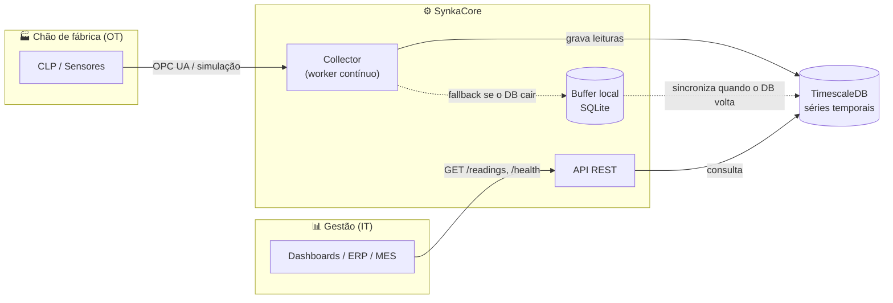
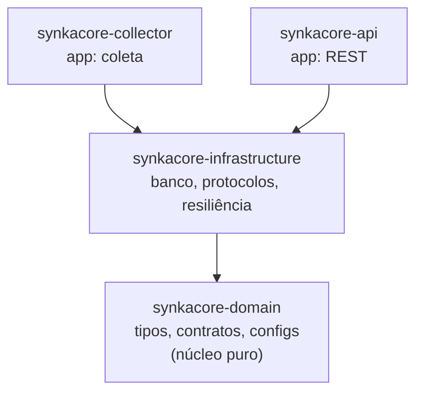

# SynkaCore

> Middleware industrial para integração **OT/IT** com resiliência e buffer local — coleta, normaliza, persiste e expõe dados de chão de fábrica **sem perder nada** quando o banco cai.


---

## O que é

O SynkaCore é a ponte confiável entre o **chão de fábrica (OT — Operational Technology)** e os
**sistemas de gestão (IT — Information Technology)**. Ele lê dados de CLPs e sensores via protocolos
industriais, normaliza para um formato unificado, persiste em banco de séries temporais e expõe via
API REST — e **garante zero perda de dados** durante quedas do banco, de qualquer duração.



---

## Por que ele existe

Em ambiente industrial real, queda de banco não é exceção — é rotina (manutenção, troca de servidor,
falha de disco, interrupção de rede entre fábrica e datacenter). Um middleware que perde dados nesses
períodos não é viável em produção. O SynkaCore foi construído com isso no centro:

- **Resiliência reativa** — pipeline Resilience4j (circuit breaker → retry → timeout) protege o banco
  e o worker durante instabilidade.
- **Buffer local** — se o TimescaleDB ficar indisponível, as leituras vão para um buffer SQLite e são
  sincronizadas em ordem cronológica quando o banco volta. **Nenhuma leitura é perdida.**
- **Observabilidade desde a fundação** — health check real (`SELECT 1`), três estados operacionais do
  worker (CONECTADO / RECONECTANDO / DEGRADADO) e logs estruturados.

---

## Arquitetura — Clean Architecture multi-módulo

A dependência sempre aponta para dentro, em direção ao núcleo puro. Trocar a fonte de dados
(simulador → OPC UA real) é mudar **um bean**, sem tocar no worker.



| Módulo | Papel | Exemplos |
|---|---|---|
| **synkacore-domain** | Núcleo puro: o *quê* | `SensorReading`, `ProtocolReader`, `ReadingRepository` |
| **synkacore-infrastructure** | Tecnologia: o *como* | TimescaleDB, SQLite, Resilience4j, Eclipse Milo, simulador |
| **synkacore-collector** | App que coleta | `SensorCollectorWorker` + wiring |
| **synkacore-api** | App que expõe | `GET /readings`, `GET /health` |

---

## Stack tecnológica

| Camada | Tecnologia |
|---|---|
| Linguagem / framework | Java 25 + Spring Boot 3.5 |
| Build | Maven (multi-módulo) |
| Banco de séries temporais | PostgreSQL + TimescaleDB (PG17) |
| Acesso a dados | Spring `JdbcClient` |
| Buffer local | SQLite |
| Resiliência | Resilience4j (circuit breaker, retry, timeout) |
| Protocolo industrial | OPC UA (Eclipse Milo) |
| Logging | SLF4J + Logback |
| Testes | JUnit 5, Mockito, Testcontainers |

---

## Como rodar

### Pré-requisitos

- [JDK 25](https://adoptium.net/)
- [Maven 3.9+](https://maven.apache.org/download.cgi)
- [Docker](https://docs.docker.com/engine/install/) + Docker Compose

### 1. Subir o banco

O `docker-compose.yml` sobe o TimescaleDB **já com a tabela, a hypertable e os índices criados**
(via `scripts/init-db.sql`). Não há passo manual de SQL.

```bash
docker compose up -d
```

### 2. Build + testes

```bash
mvn clean verify
```

### 3. Rodar as aplicações (terminais separados)

```bash
# Terminal 1 — coletor (worker contínuo)
mvn -pl synkacore-collector spring-boot:run

# Terminal 2 — API REST
mvn -pl synkacore-api spring-boot:run
```

### 4. Consultar

```bash
curl http://localhost:8080/readings   # últimas 100 leituras (JSON)
curl http://localhost:8080/health     # verifica conectividade real com o banco
```

> Por padrão o collector usa o `VacuumChamberSimulator` (câmara de vácuo de curtimento) como fonte de
> dados, então não é preciso hardware nem servidor OPC UA para ver o sistema funcionando.

---

## Endpoints da API

| Endpoint | Descrição |
|---|---|
| `GET /readings` | Retorna as últimas 100 leituras em JSON |
| `GET /health` | Executa `SELECT 1` no banco — HTTP 200 `connected` ou HTTP 503 `unavailable` |

---

## Estrutura do projeto

```
SynkaCore/
├── synkacore-domain/          # tipos, contratos, configs, exceções (núcleo puro)
├── synkacore-infrastructure/  # persistência, protocolos, resiliência, simulação
├── synkacore-collector/       # app: worker de coleta contínua
├── synkacore-api/             # app: REST de consulta + health
├── config/                    # configs de qualidade (spotbugs, pmd, checkstyle)
├── scripts/                   # init-db.sql (criação automática do schema)
├── docker-compose.yml         # TimescaleDB pronto para subir
└── docs/                      # documentação detalhada
```

---

## Documentação

- **[Visão geral visual](docs/VISAO-GERAL.md)** — diagramas de fluxo, cenários de queda e recuperação.
- **Versões** — [V1.0](docs/V1.0.md) · [V1.1](docs/V1.1.md) · [V1.2](docs/V1.2.md).
- **[Trade-offs](docs/TRADE-OFFS.md)** — decisões técnicas e seus custos.
- **[Qualidade](docs/QUALIDADE.md)** — garantias do build (SpotBugs, PMD, Checkstyle, OWASP).

---

## Roadmap

| Versão | Status | Entrega |
|---|---|---|
| V1.0 | ✅ Concluída | Fundação: coleta, persistência, API REST |
| V1.1 | ✅ Concluída | Resiliência (Resilience4j), observabilidade, health check real |
| V1.2 | ✅ Concluída | Buffer local SQLite — zero perda em quedas prolongadas |
| V1.3 | 🔜 Planejada | Simulação realista de Modbus TCP e MQTT |
| V1.4 | 🔜 Planejada | OPC UA com autenticação SignAndEncrypt |
| V1.5 | 🔜 Planejada | Endpoint Prometheus + dashboard Grafana |
| V2.0 | 🔜 Planejada | SynkaEdge (gateway Go) + SynkaStudio (Angular) |
