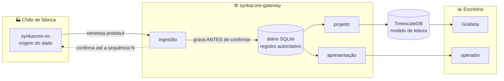
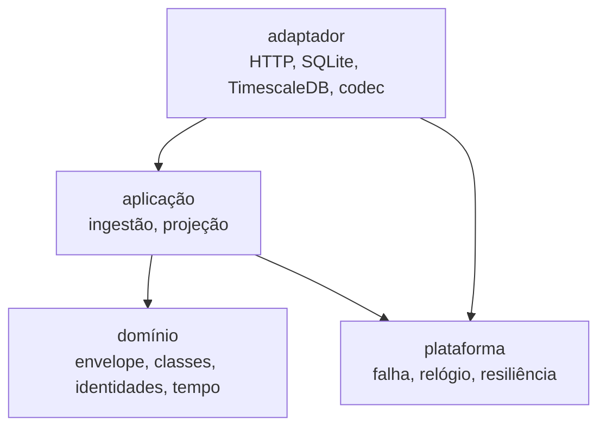

# SynkaCore

> Plataforma de aquisição industrial **OT/IT** para borda: coleta, valida, torna durável e
> expõe dados de chão de fábrica — **sem perder nada**, sem nuvem e sem depender de que o
> banco de consulta esteja de pé.


-003B57)


---

## O que é

O SynkaCore é a ponte confiável entre o **chão de fábrica (OT)** e os **sistemas de gestão
(IT)**. Origens de dado — equipamento embarcado, ou o nó em software que acompanha o projeto
— entregam remessas ao gateway por um contrato de fio versionado. O gateway valida, torna
**durável no disco local** e confirma. Um projetor assíncrono alimenta o banco de séries
temporais que os dashboards consultam.



---

## A propriedade central

**A remessa só é confirmada depois de estar durável no disco.** Se a gravação falha, o nó
não recebe confirmação e retransmite. Se o gateway cai no meio, o nó retransmite. Se o
TimescaleDB cai, **a aquisição não percebe** — o dado continua entrando no diário e a
projeção retoma sozinha quando o banco volta.

Isso não é um mecanismo de emergência; é o único caminho que existe.

> Na V1.x, zero perda dependia de um caminho de exceção — um buffer que só era exercitado
> durante a falha. A auditoria da V1.2 encontrou esse caminho **desligado por um erro de
> tipo no construtor**: o buffer estava registrado e nunca era usado, e o dado se perdia
> como antes de ele existir. Um caminho que quase nunca roda é um caminho que não funciona.
> Ver [V2.0](docs/V2.0.md).

### Verificado, não afirmado

Teste de ponta a ponta com o gateway derrubado por 14 segundos enquanto o nó continuava
amostrando a 2 Hz:

```
registros gravados  : 123
sequências faltando : NENHUMA
duplicatas          : NENHUMA
lacunas de amostragem: NENHUMA
```

---

## Sem hardware físico

O `synkacore-no` é um processo separado que simula uma **câmara de vácuo de curtimento** —
temperatura, pressão, estado de máquina e contagem de peças, em ciclo realista de 3 minutos
— e fala com o gateway pelo **mesmo contrato de fio** que um equipamento embarcado usaria.

O gateway não tem como saber a diferença. Serialização, lote, contrapressão, retransmissão,
idempotência e ancoragem de tempo são todos exercitados de verdade, e trocar o simulador por
hardware real deixa de ser uma integração: passa a ser uma troca de quem gera os números.

---

## Como rodar

### Sem infraestrutura nenhuma

A aquisição funciona completa e o dado fica durável. Só falta o gráfico.

```bash
make compilar

./bin/synkacore-gateway     # terminal 1
./bin/synkacore-no          # terminal 2

curl http://127.0.0.1:8080/saude
curl 'http://127.0.0.1:8080/leituras?limite=10'
```

### Com o modelo de leitura e os dashboards

```bash
make infra                  # TimescaleDB + Grafana
make gateway-completo       # terminal 1
make no                     # terminal 2
```

Grafana em `http://localhost:3000` (`admin`/`admin`), com a fonte de dados já provisionada.

### Pré-requisitos

- [Go 1.26+](https://go.dev/dl/) — **só isso** para compilar e rodar
- Docker ou Podman, apenas para o estágio de consulta
- `protoc` + `protoc-gen-go`, apenas para regerar o contrato

---

## Endpoints

Dois servidores, em interfaces separadas, porque o gateway fica entre duas redes.

**Ingresso — lado de chão de fábrica** (`127.0.0.1:8443`)

| Endpoint | Descrição |
|---|---|
| `POST /ingestao` | Recebe uma remessa protobuf; devolve a confirmação com a faixa durável |

**Apresentação — lado de escritório** (`127.0.0.1:8080`), somente leitura

| Endpoint | Descrição |
|---|---|
| `GET /saude` | Estado do diário e da projeção, verificados de verdade |
| `GET /leituras?limite=N` | Registros recentes do diário, já decodificados |
| `GET /contrato` | Tipos de conteúdo que este gateway reconhece |

O `/saude` reporta os dois estágios **separados**, e a distinção decide se alguém é
acordado:

```json
{"journal":"available","projection":"degraded","projection_since":"...","checked_at":"..."}
```

`journal` falhando significa que o sistema está perdendo a capacidade de aceitar dado.
`projection` falhando significa que o dado está salvo e os dashboards estão atrasados.

---

## Arquitetura

Hexagonal enxuto, aplicado onde ele paga por si. A regra de dependência é única:



O domínio não importa HTTP, banco, arquivo nem relógio. Não é purismo: é o que permite
testar a regra de tempo e a de idempotência sem subir Postgres.

**Onde deliberadamente não abstraímos**, porque abstração sem segunda implementação é só
indireção:

| Não abstraído | Motivo |
|---|---|
| Diário SQLite | É a definição de durabilidade do sistema, não uma escolha. Nunca haverá um segundo. O teste usa arquivo temporário, que é mais fiel que um dublê. |
| Logging | `log/slog` direto. Envolver o logger só produziria uma API pior. |
| Relógio | Injetado como interface de **dois** métodos, e os dois existem por uma razão que custou um achado bloqueante — ver abaixo. |

### Nomes

Identificadores em **português sem acento**, porque o vocabulário do domínio já é português
em toda a documentação. Inglês fica onde a linguagem impõe (`main`, `Error`, `String`), onde
o compilador reconhece a estrutura (`internal/` **não é escolha**: o Go impõe que pacotes
ali não sejam importáveis de fora) e nos identificadores que **saem do processo** — rótulo
de métrica e coluna de banco são consumidos por Prometheus, Grafana e SQL.

Não existe `utils`, `helpers`, `common` ou `models`: são gavetas onde código duplicado se
esconde, porque nenhum desses nomes diz o que **não** pertence ali.

---

## Invariantes, e como cada um é travado

Documentar "não duplique" não sustenta nada. Cada item abaixo é uma trava real no código.

| Invariante | Trava |
|---|---|
| **Um ponto de validação por conceito** | `NovoEnvelope` é o único construtor de mensagem. Campos não exportados ⇒ possuir um `Envelope` é prova de que ele é válido. Não existe "validar de novo por segurança". |
| **Um catálogo que recusa duplicata na inicialização** | `NovoCatalogoDeConteudo` rejeita tipo repetido. Dois arquivos definindo o mesmo tipo derrubam o gateway **no boot**, não em produção. |
| **O catálogo cobre o contrato** | `TestTodoConteudoDoContratoTemDefinicao` lê o descritor do protobuf por reflexão. Acrescentar uma mensagem ao contrato sem ensinar o gateway a interpretá-la reprova o build. |
| **Exaustividade sobre enum** | Os `switch` sobre `ClasseDeDado`, `EstadoDeMaquina` e `falha.Categoria` **não têm `default`**, e o linter roda com `default-signifies-exhaustive: false`. |
| **Um projetor genérico, não um por tipo** | Cada conteúdo declara o que contribui ao modelo de leitura; o projetor não conhece tipo nenhum. |
| **Uma taxonomia de erro, um mapeador por adaptador** | `falha.Categoria` é o vocabulário único; `statusDe` é o único condicional sobre erro no adaptador HTTP. |
| **Nenhum código duplicado** | `dupl`, `goconst`, `gocognit` e `nestif` no `golangci-lint`, verificados a cada `make verificar`. |

---

## Duas coisas que valem ler

### O relógio tem dois métodos, e isso resolve um achado bloqueante

Em Go, `time.Time` carrega uma leitura monotônica — e **qualquer `.UTC()` a descarta**. A
partir dali, subtrair dois instantes usa o relógio de parede, que anda para trás quando o
NTP corrige. Numa trilha que precisa provar *quando* algo aconteceu, isso deixa de ser
corretude e vira conformidade.

`plataforma/relogio` mantém as duas leituras separadas e **comparáveis entre si**: um acerto
de hora move só a parede, então a divergência vira mensurável. O `relogio.Falso` tem
`Avancar` (move as duas juntas, que é o tempo normal) e `DarDegrau` (move só a parede) —
um degrau real é impossível de reproduzir em CI; aqui é uma chamada de método.

### O nó não pode parar de medir

O teste de ponta a ponta encontrou o nó **parando de amostrar por 15 segundos** durante uma
queda de 12 segundos do gateway: amostragem e despacho dividiam um `select`, e o recuo do
despacho dormia bloqueando o temporizador.

A distinção que isso revela é a que importa. O buffer protege contra perder dado **no
caminho** — e para isso funcionava. Mas dado que **nunca foi medido** não está em buffer
nenhum, e nenhuma retransmissão o traz de volta.

Hoje são dois laços independentes, e um teste de regressão mede o **espaçamento entre
tempos ligados** para garantir que continue assim.

---

## Estrutura

```
SynkaCore/
├── contrato/proto/       # o .proto — fonte única de verdade do fio
├── cmd/                  # raízes de composição: o único lugar com wiring
├── internal/
│   ├── contrato/v1/      # gerado do .proto, versionado de propósito
│   ├── dominio/          # regras. Sem I/O, sem framework, sem relógio.
│   ├── aplicacao/        # ingestão e projeção
│   ├── adaptador/        # entrada, saída, codec
│   ├── no/               # a origem do dado e a simulação de processo
│   └── plataforma/       # falha, relógio, resiliência, identificador
├── migracoes/            # esquema do modelo de leitura
├── implantacao/grafana/  # provisionamento como código
├── legado/java-v1.2/     # a implementação V1.x, preservada
└── docs/
```

---

## Build e qualidade

```bash
make verificar    # formatação, vet, testes com -race, linter, contrato em dia
make compilar     # binários estáticos, sem cgo
make contrato     # regera o Go a partir do .proto
make cobertura    # relatório de cobertura em HTML
```

`make verificar` é o portão completo — qualquer falha derruba o build. Disciplina imposta
pela ferramenta, não pela boa vontade.

O binário é **verdadeiramente estático**, sem dependência de runtime. É o argumento que
decidiu a linguagem: implantar é copiar **um arquivo** e uma unidade systemd, e reverter é
manter o arquivo anterior. Numa planta sem internet, atualizada pelo notebook de um técnico,
isso vale mais que qualquer vantagem de velocidade bruta.

---

## Documentação

- **[V2.0](docs/V2.0.md)** — a reescrita: por que foi antecipada, o que mudou, o que foi
  encontrado no caminho.
- **[Visão geral visual](docs/VISAO-GERAL.md)** — diagramas de fluxo e cenários de queda.
- **[Trade-offs](docs/TRADE-OFFS.md)** — decisões técnicas e seus custos.
- **[Qualidade](docs/QUALIDADE.md)** — os portões do build.
- **[Propriedade intelectual](docs/PROPRIEDADE-INTELECTUAL.md)** — anterioridade, manifesto
  criptográfico e o caminho do registro no INPI.
- **Histórico V1.x** — [V1.0](docs/V1.0.md) · [V1.1](docs/V1.1.md) · [V1.2](docs/V1.2.md),
  com o código em [`legado/java-v1.2/`](legado/java-v1.2/).

---

## Roadmap

| Versão | Status | Entrega |
|---|---|---|
| V1.0 | ✅ Concluída | Fundação em Java: coleta, persistência, API REST |
| V1.1 | ✅ Concluída | Resiliência, observabilidade, health check real |
| V1.2 | ✅ Concluída | Buffer local SQLite; auditoria estrutural |
| V1.3–V1.5 | ❌ Canceladas | Exigiam hardware físico — ver [V2.0](docs/V2.0.md) |
| **V2.0** | 🚧 Em desenvolvimento | Reescrita em Go, contrato de fio, durabilidade estrutural, nó em software |
| V2.1 | 🔜 Planejada | mTLS com CA interna; identidade autenticada vs. reivindicada |
| V2.2 | 🔜 Planejada | Configuração da instalação: canal → ponto de medição, catálogo de motivos |
| V2.3 | 🔜 Planejada | Dashboards do Grafana como código; teste de carga |
