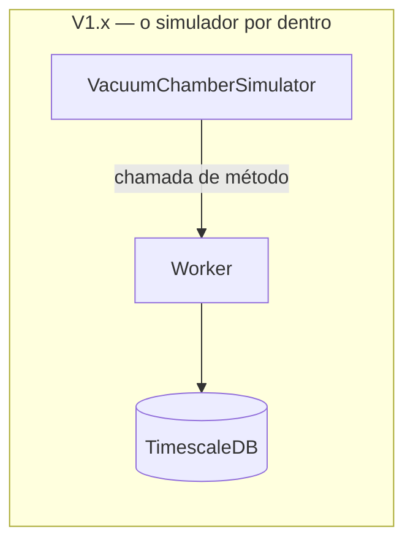
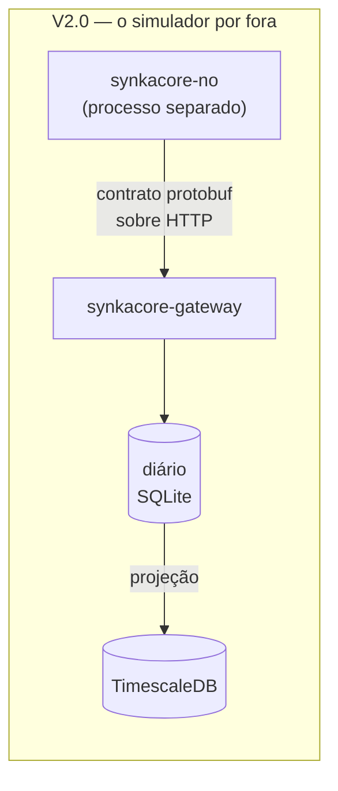
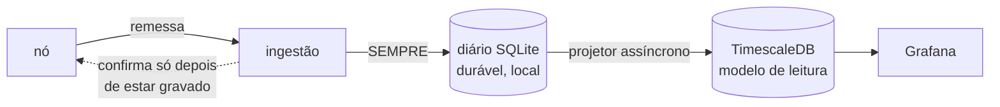

# SynkaCore V2.0 — Reescrita em Go e Absorção da Arquitetura Basalt

**Status:** Em desenvolvimento
**Data:** Agosto de 2026
**Substitui:** o roteiro V1.3–V1.5, que fica cancelado

---

## Por que a V2.0 foi antecipada

O roteiro anterior travou por uma razão que nenhuma decisão de software resolvia: **as
versões seguintes exigiam hardware que não existe aqui.**

| Versão planejada | O que exigia |
|---|---|
| V1.3 | Servidor Modbus TCP e broker MQTT reais |
| V1.4 | Servidor OPC UA com certificado e autenticação SignAndEncrypt |
| V1.5 | Instrumentação sobre carga real, para as métricas significarem algo |

Sem CLP, sem sensor e sem servidor OPC UA, essas versões não são adiáveis — elas são
**não executáveis**. Continuar naquele roteiro significaria escrever código que ninguém
consegue exercitar, e código não exercitado é código que não funciona.

A V2.0 já estava no roteiro como "SynkaEdge (gateway Go) + SynkaStudio (Angular)". Ela foi
**antecipada e redefinida**: em vez de um componente Go somado ao middleware Java, o
projeto inteiro passa a ser Go, e absorve a arquitetura de um segundo projeto.

---

## A saída: o nó em software

Existia um segundo projeto — o **Basalt** — desenvolvido apenas como arquitetura e
documentação: 18 ADRs, um contrato protobuf e cerca de 1.800 linhas de domínio em Go. Ele
resolvia a mesma classe de problema: aquisição industrial offline-first, sem nuvem, com
gateway de borda.

Manter dois projetos que respondem à mesma pergunta não faz sentido. O SynkaCore absorve o
Basalt inteiro, e junto vem a peça que destrava o impasse do hardware.

**A ideia central: o simulador deixa de ser uma dependência injetada e passa a ser um
processo separado que fala pelo fio.**





A diferença não é de arrumação. Na V1.x, o simulador entregava um objeto pronto por chamada
de função, e **tudo o que é difícil ficava sem exercício**: serialização, lote,
contrapressão, retransmissão, idempotência, ancoragem de tempo. Na V2.0 o nó atravessa o
mesmo caminho que um equipamento embarcado atravessaria, e o gateway não tem como saber a
diferença.

Trocar o simulador por hardware real deixa de ser uma integração e passa a ser **uma troca
de quem gera os números**.

---

## A inversão que mais importa: durabilidade estrutural

Esta é a mudança de maior consequência da V2.0, e ela nasceu de um defeito real encontrado
na auditoria da V1.2.

### Como era

O worker escrevia **direto no TimescaleDB**. Se o banco caísse, um decorator desviava a
leitura para um buffer SQLite de emergência e sincronizava depois. Zero perda dependia de um
**caminho de exceção** funcionar no pior momento possível.

O [bug 1 da V1.2](V1.2.md) foi exatamente isso: o worker recebia `SensorReadingRepository`
(o tipo concreto) em vez de `ReadingRepository` (a interface). Todo o sistema de buffer
estava registrado no container e **nunca era usado**. Quando o banco caía, o dado se perdia
— exatamente como antes de o buffer existir, e sem nada acusar.

O defeito é instrutivo porque não foi descuido isolado: **um caminho que quase nunca roda é
um caminho que não funciona.** Ele só é exercitado durante a falha, que é quando ninguém
está olhando.

### Como é

Não existe mais caminho de exceção.



Toda remessa aceita é gravada no diário local **antes de qualquer confirmação ao nó**. Um
projetor assíncrono alimenta o banco de consulta a partir dali.

As consequências:

| | V1.x | V2.0 |
|---|---|---|
| Queda do banco de consulta | Ameaça o dado; ativa caminho de emergência | Atrasa os dashboards; a aquisição não percebe |
| Zero perda | Promessa que depende de um caminho raro funcionar | Consequência de só existir um caminho |
| Se a gravação falha | Buffer de emergência, e se ele falhar também, perde | A remessa **não é confirmada**, e o nó retransmite |
| Recuperação | Sincronização especial, código próprio | Nenhuma: o projetor retoma do cursor |

O registro autoritativo passa a ser o diário, com os **bytes brutos que o nó enviou**. O
TimescaleDB é uma projeção, reconstruível inteira a partir dali.

---

## O que o Basalt trouxe

O raciocínio dos 18 ADRs transferiu integralmente — ele nunca foi sobre linguagem.

### Envelope canônico e ponto único de validação

`aquisicao.NovoEnvelope` é o **único** construtor de mensagem do sistema. Campos não
exportados mais construtor validante significam que **possuir um `Envelope` é prova de que
ele é válido**. Não existe "validar de novo por segurança" em camada alguma acima — essa é
a origem mais comum de validação divergente, duas checagens da mesma coisa que discordam
depois de seis meses.

### ClasseDeDado com cinco políticas

O dado é classificado pela **garantia que exige**, não pelo assunto. Cada classe carrega
cinco políticas, definidas num lugar só:

| | `ClasseAmostra` | `ClasseEventoDiscreto` |
|---|---|---|
| Garantia de entrega | Melhor esforço | Ao menos uma vez |
| Saturação de buffer | Descartar mais antigo | Registrar lacuna |
| Latência máxima | 5 s | 200 ms |
| Durabilidade local | Em memória | Em disco, sempre |
| Retenção | 7 dias brutos, agregável, 1 ano | 5 anos, íntegro, nunca agregado |

Uma amostra de temperatura e uma parada de máquina têm requisitos **opostos**: a primeira
tolera perda porque a próxima repõe quase a mesma informação; a segunda não tem vizinha que
a substitua, e a contagem fica permanentemente errada sem ninguém perceber.

Os `switch` sobre `ClasseDeDado` **não têm cláusula `default`**, e o linter `exhaustive`
está configurado com `default-signifies-exhaustive: false`. Acrescentar uma classe reprova
o build em todo ponto que exige uma decisão.

> Uma versão anterior desse desenho tinha `default` e documentava isso como se fosse uma
> trava. Não era: a classe nova cairia no padrão em silêncio.

### Chave de idempotência natural

`(dispositivo, sessão de boot, número de sequência)`. Store-and-forward com retransmissão
**sempre** gera entrega duplicada — é consequência do desenho, não defeito. A deduplicação
acontece num lugar só: a restrição de unicidade sobre essa chave no diário.

### O gateway é a única autoridade de tempo

O nó **nunca afirma saber a hora**. Ele reporta tempo monotônico desde o boot e sorteia um
identificador de sessão a cada partida. O gateway carimba a recepção e deriva o instante
estimado. Os três tempos ficam separados, e **o derivado jamais sobrescreve o bruto**.

### As três identidades separadas

`identidadededispositivo` (a peça de hardware) é distinta de `pontodemedicao` (a posição na
planta), ligadas por um `Vinculo` datado. Trocar um dispositivo queimado não rompe a série
histórica, porque a série pertence ao **ponto**.

---

## O que a V1.x contribuiu para a fusão

A transferência não foi de mão única. Estas peças são do SynkaCore e o Basalt não tinha:

**Os três estados operacionais** (`Conectado`, `Reconectando`, `Degradado`), agora
descrevendo a **projeção** em vez do worker. A mudança de posição muda o significado:
`Degradado` deixou de significar "o sistema pode estar perdendo dado" e passou a significar
"o dado está salvo, os dashboards estão atrasados". O operador de plantão precisa saber a
diferença às três da manhã.

**A pipeline de resiliência** — disjuntor por taxa de falha, recuo exponencial com jitter,
tempo limite por tentativa. O desenho atravessou a mudança de linguagem intacto porque nada
nele era sobre Java. O que mudou foi onde ela se aplica: protege a projeção, não a aquisição.

**A simulação de processo industrial** — a câmara de vácuo de curtimento, agora com pressão
como segunda grandeza acoplada à temperatura, e com gerador injetável (a V1.x usava
`ThreadLocalRandom` estático e registrou a irreprodutibilidade como débito).

**O health check que não mente** e a **validação de configuração no startup** continuam
valendo como princípios.

---

## Defeitos encontrados durante a V2.0

### O nó parava de amostrar durante a queda do gateway

Encontrado pelo teste de ponta a ponta, e é o mais grave dos dois.

O laço do nó tinha amostragem e despacho no mesmo `select`. O recuo do despacho **dorme**, e
dormindo bloqueava o temporizador de amostragem. Uma queda de 12 segundos do gateway
produziu **15 segundos sem nenhuma medição**.

A distinção que isso revela é a que importa: o buffer protege contra perder dado **no
caminho** — e para isso funcionava. Mas dado que **nunca foi medido** não está em buffer
nenhum, e nenhuma retransmissão o traz de volta. Uma queda de rede havia virado um buraco
permanente na série.

Correção: dois laços em goroutines independentes. Amostragem em período fixo garantido por
temporizador; despacho em melhor esforço, sujeito à rede.

### O teste de regressão inicial não pegava o defeito

Anotado porque a lição vale mais que a correção.

O primeiro teste verificava **contiguidade de sequência**. Ele passava com o defeito
reintroduzido — e a razão é que o número de sequência é atribuído no enfileiramento: um
amostrador travado produz **menos** amostras, todas perfeitamente contíguas. A contiguidade
é cega para uma parada de amostragem.

O instrumento certo é o espaçamento entre os **tempos ligados**, que vêm do relógio
monotônico no instante da medição. O teste corrigido reprova com "maior intervalo entre
amostras = 108 ms, acima do limite de 30 ms".

---

## Degrau de relógio: um achado que o Basalt considerava difícil em Go

O ADR-018 do Basalt registrou que o `.UTC()` do Go **descarta a leitura monotônica** de um
`time.Time`, deixando o modelo de tempo vulnerável a acerto de relógio — e que o
`TimeProvider` do .NET resolveria isso melhor.

Com exigência de rastreabilidade, isso deixa de ser corretude e vira **conformidade**: não
se pode provar quando algo aconteceu se o relógio pode retroceder em silêncio.

A V2.0 resolve em Go, e a solução é simples: **as duas leituras viajam separadas e são
comparáveis entre si.**

```
plataforma/relogio.Relogio:
    Agora()     — relógio de parede, em UTC. Pode dar degrau.
    Decorrido() — monotônico desde a partida do processo. Nunca retrocede.
```

A âncora de sessão de boot guarda as duas. Um acerto de hora move só a parede, então a
divergência entre elas vira **mensurável** — e `VerificarDegrauDeRelogio` a recusa.

O `relogio.Falso` fecha o outro lado do problema: ele tem `Avancar` (move as duas juntas,
que é o tempo normal) e `DarDegrau` (move só a parede, que é o que um acerto de hora faz).
Um degrau real é impossível de reproduzir em integração contínua; aqui ele é uma chamada de
método.

A âncora é **persistida** no diário, com o identificador da execução do processo que a
criou — sem isso, uma leitura monotônica gravada antes de um reinício seria comparada com a
do processo atual, e a diferença entre duas contagens sem relação apareceria como um degrau
gigante e completamente falso.

---

## Convenção de nomes

**Identificadores em português, sem acento.** `PontoDeMedicao`, não `MeasurementPoint`.

O vocabulário do domínio já é português em toda a documentação — "ponto de medição", "sessão
de boot", "parada de máquina", "lote". Com identificadores em inglês, todo leitor faria
tradução mental constante entre o que os documentos dizem e o que o código diz.

Inglês fica onde a linguagem ou o ecossistema exigem, e são três casos:

1. **Impostos pela linguagem** — `main`, `Error()`, `String()`, `Unwrap()`.
2. **Estrutura reconhecida pelo compilador** — `internal/` não é escolha: o Go **impõe** que
   pacotes ali não sejam importáveis de fora do módulo. Traduzir para `interno/` perderia
   uma garantia real da linguagem em troca de consistência cosmética. `cmd/` acompanha por
   convenção universal.
3. **Identificadores que saem do processo** — rótulo de métrica, chave de log estruturado e
   coluna do modelo de leitura são consumidos por Prometheus, Grafana e SQL, cujo
   vocabulário é inglês. Daí `ClasseAmostra.String()` devolver `"sample"`.

---

## Estrutura

```
SynkaCore/
├── contrato/proto/synkacore/contrato/v1/
│   └── aquisicao.proto          # fonte única de verdade do fio
├── cmd/
│   ├── synkacore-gateway/       # raiz de composição do gateway
│   └── synkacore-no/            # raiz de composição do nó
├── internal/
│   ├── contrato/v1/             # gerado do .proto — versionado de propósito
│   ├── dominio/                 # regras. Sem I/O, sem framework, sem relógio.
│   │   ├── aquisicao/           # envelope, classes de dado, catálogo, conteúdos
│   │   ├── identidadededispositivo/
│   │   ├── pontodemedicao/
│   │   ├── autoridadedetempo/
│   │   └── estadooperacional/
│   ├── aplicacao/
│   │   ├── ingestao/            # receber, ancorar, gravar, confirmar
│   │   └── projecao/            # diário → banco de consulta
│   ├── adaptador/
│   │   ├── entrada/ingressohttp/      # lado OT
│   │   ├── entrada/apresentacaohttp/  # lado TI
│   │   ├── codecdefio/                # protobuf ↔ domínio
│   │   └── saida/diariosqlite/        # o diário
│   │   └── saida/projetortimescale/   # o modelo de leitura
│   ├── no/                      # a origem do dado
│   │   └── simulacao/           # a câmara de vácuo
│   └── plataforma/
│       ├── falha/               # a única taxonomia de erros
│       ├── relogio/             # parede e monotônico, separados
│       ├── resiliencia/         # disjuntor, retentativa, tempo limite
│       └── identificador/
├── migracoes/                   # esquema do modelo de leitura
├── implantacao/grafana/         # provisionamento como código
└── legado/java-v1.2/            # a implementação V1.x, preservada
```

Não existe `utils`, `helpers`, `common` ou `models`. São gavetas onde código duplicado se
esconde, porque nenhum desses nomes diz o que **não** pertence ali.

---

## Duas redes, dois servidores

O gateway fica entre a rede de chão de fábrica e a rede de escritório, e é o ponto onde as
duas se encontram.

O instinto é endurecer o lado OT. Mas o lado OT é o mais controlado que existe — só há
origens que nós mesmos provisionamos. O lado de escritório recebe estações que não
administramos, possivelmente desatualizadas, na rede onde as pessoas leem e-mail. **A
superfície de ataque real é o serviço HTTP do gateway, não o chão de fábrica.**

Daí a estrutura:

| Servidor | Porta padrão | O que expõe |
|---|---|---|
| Ingresso (OT) | `127.0.0.1:8443` | `POST /ingestao` |
| Apresentação (TI) | `127.0.0.1:8080` | `GET /saude`, `GET /leituras`, `GET /contrato` |

São **dois `http.Server` distintos**, e não dois caminhos no mesmo multiplexador. Um
multiplexador único pareceria mais simples e destruiria a separação: bastaria publicar a
porta errada para o caminho de aquisição ficar exposto ao escritório.

A apresentação é **somente leitura**, e a ausência de caminho de escrita é deliberada: o
SynkaCore observa e nunca comanda equipamento industrial. Um atacante bem-sucedido corrompe
dado — não danifica equipamento nem fere pessoas.

---

## Stack

| Camada | V1.x | V2.0 |
|---|---|---|
| Linguagem | Java 25 + Spring Boot 3.5 | Go 1.26, sem framework |
| Build | Maven multi-módulo | `go build` + Makefile |
| Contrato de fio | — | Protobuf, gerado |
| Diário local | SQLite (buffer de emergência) | SQLite (**caminho primário**), `modernc.org/sqlite` |
| Banco de consulta | TimescaleDB (escrita direta) | TimescaleDB (**projeção**), `pgx` |
| Resiliência | Resilience4j | `plataforma/resiliencia` |
| Logging | SLF4J + Logback | `log/slog` |
| Testes | JUnit 5, Mockito, Testcontainers | `testing`, arquivo temporário real |

O driver SQLite é **Go puro, sem cgo**, e a escolha é coerente com o motivo de a linguagem
ter sido escolhida: `mattn/go-sqlite3` é mais rápido e quebraria o binário estático. Com
lote e group commit, o diário faz dezenas de transações por segundo — desempenho de driver é
irrelevante nessa faixa. Ganhar velocidade que não falta pagando com a única propriedade que
importa seria o pior negócio possível.

---

## Como rodar

Sem infraestrutura nenhuma — a aquisição funciona completa e o dado fica durável:

```bash
make compilar
./bin/synkacore-gateway          # terminal 1
./bin/synkacore-no               # terminal 2
curl http://127.0.0.1:8080/saude
curl http://127.0.0.1:8080/leituras?limite=10
```

Com o modelo de leitura e os dashboards:

```bash
make infra                       # TimescaleDB + Grafana
make gateway-completo
make no
```

---

## O que ainda não está fechado

Registrado explicitamente, porque decisão não tomada que fica implícita vira decisão tomada
por acidente.

| Item | Situação |
|---|---|
| **mTLS no ingresso** | O contrato prevê identidade *reivindicada* separada da *autenticada*, e o codec já deixa a conferência para o adaptador. O ingresso ainda fala HTTP puro. |
| **Contrapressão real** | `CategoriaRecursoEsgotado` mapeia para 429 com `Retry-After`, e o nó já a trata. Nada ainda **produz** essa categoria — falta a medida de saturação. |
| **Resolução canal → ponto de medição** | O domínio tem `Vinculo` datado, mas não há ainda a configuração da instalação que o alimenta. |
| **Catálogo de motivos de parada** | O contrato carrega `codigo_do_motivo` e `versao_do_catalogo_de_motivos`; o gateway ainda não valida contra catálogo. |
| **Identidade de operador e trilha encadeada** | O crachá afirmado trafega e é gravado. Falta `operatoridentity` e o encadeamento por hash. |
| **Fronteira de turno e fuso** | Bloqueia relatório por turno. O dado é UTC; a fronteira é horário local. |
| **Dashboards do Grafana** | A fonte de dados é provisionada; os painéis ainda não. |
| **Teste de carga** | A capacidade continua não validada sob carga real. |

---

## Próximos passos

1. mTLS com CA interna no ingresso, e conferência da identidade reivindicada contra a
   autenticada.
2. Configuração da instalação: mapeamento canal → ponto de medição, e catálogo de motivos.
3. Dashboards do Grafana como código.
4. Teste de carga com múltiplos nós simultâneos.
