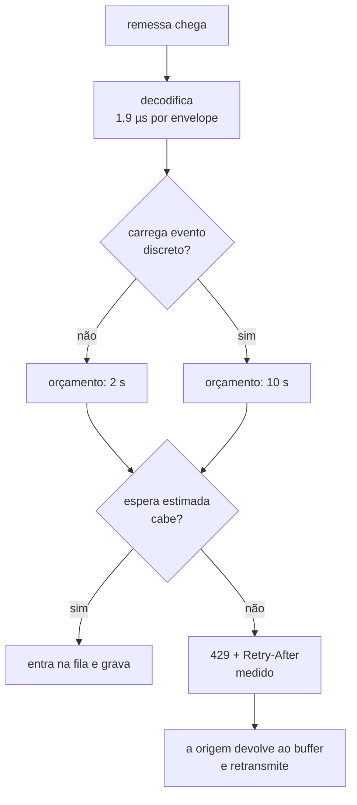

# SynkaCore V2.4 — Saturação Declarada

**Status:** Em desenvolvimento
**Data:** Agosto de 2026
**Depende de:** [V2.0](V2.0.md), [V2.1](V2.1.md), [V2.2](V2.2.md), [V2.3](V2.3.md)

---

## A pendência que três documentos registravam

> *"`RecursoEsgotado` mapeia para 429 com `Retry-After`, e o nó já trata. Nada ainda
> **produz** essa categoria — falta a medida de saturação."*
> — `docs/V2.1.md`

> *"O sistema faz contrapressão *por latência*, e ela funciona — as origens
> bufferizam. Mas nada produz `429` com `Retry-After`, então a origem descobre a
> saturação pelo tempo de resposta."*
> — `docs/V2.3.md`

O caminho estava inteiro: a taxonomia tinha a categoria, o mapeador de status
devolvia 429, o nó sabia recuar. Faltava **alguém dizer que o gateway estava
cheio** — e um caminho que nunca é exercitado é um caminho que não funciona, que é
exatamente a lição que a auditoria da V1.2 cobrou do buffer.

---

## O que estava errado em "contrapressão por latência"

Ela funcionava. O gateway ficava lento, a origem esperava, o buffer segurava, nada
se perdia. Três problemas, mesmo assim:

**A fila estava onde ninguém a media.** Ela vivia dentro do pool de conexões do
`database/sql`, invisível ao `/saude` e a qualquer painel. Um operador conseguia
ver latência subindo e não conseguia ver por quê.

**A origem inferia.** Resposta demorada pode ser saturação, rede lenta ou gateway
travado, e as três pedem coisas diferentes. Inferir a partir do tempo de resposta é
adivinhar com dado ambíguo.

**Todo mundo esperava igual.** Uma leitura de temperatura e uma parada de máquina
ficavam na mesma fila, pela mesma duração — apagando justamente a distinção de que
sai toda a política do sistema.

---

## A inversão

O terceiro problema é o que dá nome à versão, e ele decorre de uma observação que
só faz sentido neste projeto:

> **Amostra prefere ser recusada a esperar. Evento discreto prefere esperar a ser
> recusado.**

A `ClasseDeDado` já dizia isso desde a V2.0, aplicado ao buffer da origem: em
buffer cheio, a amostra mais antiga é sacrificada antes de qualquer evento. A V2.4
aplica a mesma regra à **porta de entrada do gateway**.

A razão é simétrica nos dois lados. Uma amostra entregue com dez segundos de atraso
não vale mais que a que vem atrás dela — segurar a fila com ela atrasa o que não
tem substituto. Um evento discreto não tem vizinho que o reponha, e recusá-lo
empurra para a origem uma retransmissão que pode nunca acontecer se ela reiniciar.

Recusar **não perde dado**: o lote volta ao buffer e é retransmitido. É por isso que
recusar cedo é barato para amostra e caro para evento.



Não há um contador de vagas guardadas. **A reserva é temporal, e não espacial**:
quando a fila passa do orçamento comum, as vagas que continuam sendo distribuídas
vão só para quem carrega evento discreto.

---

## Verificado, não afirmado

As duas cargas rodaram **ao mesmo tempo**, contra o **mesmo gateway**, enfrentando a
**mesma fila**. Só a classe do conteúdo diferia.

```
400 origens x 100 envelopes de amostra a cada 1s, por 25s

envelopes aceitos    : 471900  (18869/s)
contrapressao (429)  : 1537  (recusa deliberada; o gateway pediu ate 6 s)
```

```
20 origens x 100 envelopes de evento a cada 1s, por 18s

envelopes aceitos    : 18000  (1000/s)
                       (nenhuma recusa)
```

E o gateway confirmando pelo `/saude`, do outro lado:

```json
{"ingestion":"accepting","ingestion_shed_samples":2913,"ingestion_shed_events":0}
```

**2.913 amostras recusadas. Zero eventos discretos recusados.** Não por ordem de
chegada, não por tamanho de lote — pela garantia que a classe exige.

### O que a saturação fez com a cauda

| 400 origens | V2.3 (por latência) | V2.4 (declarada) |
|---|---|---|
| Envelopes/s aceitos | 20.582 | 20.612 |
| p50 | 1,4 s | 1,70 s |
| **p99** | **5,6 s** | **1,90 s** |
| Recusas explícitas | — | 1.375 |

A vazão não mudou: o teto é do disco, e contrapressão não cria capacidade. O que
mudou foi a **forma da distribuição**. A faixa entre p50 e p99 saiu de 4,2 s para
0,2 s.

O p50 subiu um pouco, e vale dizer por quê em vez de esconder: as remessas que a
V2.3 atendia devagar agora são recusadas, então elas somem da amostra de latência —
e o que sobra é medido numa fila que ficou consistentemente perto do orçamento. A
troca é essa: **uma cauda longa e imprevisível por uma banda estreita mais um número
explícito de recusas**. Para uma origem que precisa dimensionar buffer, a segunda
forma é a única sobre a qual dá para decidir alguma coisa.

### E o regime saudável continuou saudável

O risco de qualquer mecanismo de admissão é começar a recusar antes da hora. Os
orçamentos foram escolhidos a partir da própria medição da V2.3, e não por prudência
genérica:

```
200 origens x 100 envelopes de amostra a cada 1s, por 20s

envelopes aceitos    : 379900  (18994/s)
contrapressao (429)  : 1
p50 509ms   p99 989ms
```

**Uma recusa em vinte segundos.** A V2.3 mediu 18.999 env/s neste mesmo regime; a
V2.4 mede 18.994. A admissão é invisível onde o sistema dá conta, e essa é a
propriedade que decide se ela pode ficar ligada por padrão.

---

## O `Retry-After` é medido, não escrito no código

A alternativa fácil era uma constante — dois segundos, digamos —, e ela estaria
errada em toda instalação cujo disco não fosse o da máquina do autor.

A portaria mede **quanto tempo cada admitido levou lá dentro** e mantém uma média
móvel exponencial. A espera estimada é essa média multiplicada por quem está na
frente.

Medir o **efeito** em vez da **causa** é deliberado. Uma medida de CPU ou de fila de
disco exigiria acertar a tradução entre aquele número e a latência percebida, e
erraria sozinha no dia em que o gargalo mudasse de lugar. O tempo gasto lá dentro já
é a resposta, qualquer que seja a causa.

Nas rodadas acima o gateway pediu de 3 a 6 segundos, conforme a fila do momento.

### Duas travas do lado da origem

O nó obedece ao número que o gateway mediu — e recuo exponencial existe justamente
porque quem recua não tem informação nenhuma; preferir o palpite à medição seria
trocar informação por ritual. Mas obedecer tem limite:

- **O teto da origem continua valendo.** Um gateway defeituoso que pedisse uma hora
  calaria a frota por uma hora, e a origem só descobriria o engano quando o buffer
  estourasse. Obedecer não pode significar parar de verificar.
- **O jitter é da origem, e não do gateway.** O gateway manda o mesmo número para
  todo mundo; sem espalhar, as origens voltariam juntas e o pico sincronizado
  derrubaria de vez um gateway que estava apenas cheio.

Um teste de ponta a ponta trava as duas: o gateway pede 60 s, o teto da origem é
80 ms, e a entrega precisa retomar dentro da janela do teste.

### E o cabeçalho tem resolução de segundos

`Retry-After` é em segundos inteiros. Uma estimativa de 300 ms truncada viraria
`0`, e a origem voltaria na hora — o recuo deixaria de recuar exatamente quando ele
existe para atuar. O valor é **arredondado para cima**, com piso de 1 s.

A forma de **data absoluta** que o HTTP também admite é deliberadamente ignorada
pela origem: um dispositivo sem relógio de bateria nasce em 1970 e não tem como
interpretar "espere até quinta-feira, 14h32". É a mesma limitação que obrigou o
gateway a servir tempo por UDP na [V2.1](V2.1.md).

---

## Onde a decisão acontece, e o que ela custa

Depois de decodificar, antes de gravar.

**Depois de decodificar** porque a decisão depende da classe, e a classe só existe
depois da decodificação — a anotação está no `.proto` e o gateway a lê por reflexão.
Recusar antes seria recusar no escuro, tratando uma parada de máquina como uma
leitura de temperatura.

O custo dessa ordem foi medido na V2.3 e é o argumento que a sustenta:

| | Custo por envelope | Lote de 100 |
|---|---|---|
| Decodificar e validar | 1,9 µs | 190 µs |
| Gravar no diário | 33 µs | 3,3 ms |

Uma remessa recusada joga fora 190 µs de decodificação para evitar 3,3 ms de
gravação numa fila que já não dá conta. **Dezessete vezes mais barato que
admiti-la.**

**Antes de gravar** porque recusar depois não seria contrapressão: seria pagar o
congestionamento inteiro e ainda assim não entregar o dado. É também por isso que
não há tempo limite de fila — a recusa é imediata, e o que ela devolve à origem é
a informação que ela não tinha.

---

## O `/saude` ganhou uma terceira linha

```json
{
  "journal": "available",
  "projection": "disabled",
  "ingestion": "shedding",
  "ingestion_queue": 399,
  "ingestion_wait_ms": 2592,
  "ingestion_shed_samples": 404,
  "ingestion_shed_events": 0
}
```

Pela mesma razão que separou `journal` de `projection` na V2.0: as três respondem
perguntas diferentes, com destinatários diferentes.

| Linha | Se falhar significa | Acorda alguém? |
|---|---|---|
| `journal` | O sistema perdeu a capacidade de **aceitar** dado | Sim |
| `projection` | O dado está salvo; os dashboards atrasaram | Não |
| `ingestion` | O gateway está cheio; as origens estão bufferizando | Não — mas dimensione |

**Saturação não altera o status HTTP.** O `/saude` devolve 200 mesmo recusando
remessa, porque contrapressão é o sistema funcionando como projetado. Devolver 503
faria um balanceador tirar do ar o gateway que está apenas cheio, empurrando a carga
inteira para os outros — transformando saturação parcial em queda total, que é
exatamente o modo de falha que o jitter existe para evitar do outro lado.

O que muda o status continua sendo uma coisa só: o diário não responder.

### As duas recusas são contadas separadas

`ingestion_shed_samples` e `ingestion_shed_events` não são somadas, e a separação é
a informação:

- **Amostra recusada é a política funcionando.** O gateway está sacrificando o que
  tem substituto para proteger o que não tem.
- **Evento discreto recusado é o teto real sendo ultrapassado.** O gateway ficou
  cheio a ponto de dizer não ao que nenhuma amostra seguinte repõe.

Num contador único, a segunda desapareceria dentro da primeira — que sobe todo dia
sem significar nada.

---

## Um defeito que a versão só encontrou porque mexeu na raiz de composição

A V2.4 alterou `cmd/synkacore-gateway/main.go`, e o `git status` não acusou a
mudança.

O `.gitignore` trazia `synkacore-gateway` e `synkacore-no` para ignorar binários
soltos. **Sem barra inicial, esses são padrões de nome e casam com qualquer
componente de caminho** — inclusive os diretórios `cmd/synkacore-gateway/` e
`cmd/synkacore-no/`.

As duas raízes de composição do projeto estavam fora do controle de versão, e nada
acusava: `git status` não mostra arquivo ignorado como não rastreado.

Duas consequências, e a segunda é a séria:

- **Um clone limpo não compilava.** O diretório do gateway simplesmente não existia
  nele.
- **O manifesto criptográfico fechava sobre uma árvore incompleta.** `make
  manifesto` monta a lista com `git ls-files`, então o hash raiz — o artefato que o
  registro no INPI consome, descrito em
  [PROPRIEDADE-INTELECTUAL](PROPRIEDADE-INTELECTUAL.md) — **não cobria o `main.go`
  do gateway nem o do nó**. `make manifesto-conferir` respondia "confere", e estava
  certo: ele confere a lista contra si mesma, e a lista é que estava curta.

Corrigido ancorando os padrões na raiz (`/synkacore-gateway`), que é o que `/bin/`
já fazia pelos binários de verdade.

O mesmo lote fechou um segundo vazamento na mesma superfície: o `__pycache__` do nó
MicroPython estava versionado, e o teste de fidelidade — que executa Python — o
reescrevia a cada `make verificar`. Rodar os testes sujava a árvore e mudava o hash
raiz, tornando `manifesto-conferir` uma pergunta cuja resposta dependia de quando
alguém rodou o build.

> Os dois casos são a mesma espécie de defeito que este projeto vem catalogando
> desde a V1.2: um mecanismo que responde "sim" sem ter verificado o que o
> interlocutor pensou que ele verificou.

---

## O que continua aberto

| Item | Situação |
|---|---|
| **Separar a conexão de leitura** | A V2.3 identificou o escritor serializado como o gargalo, e a V2.4 tornou a fila dele visível e recusável — mas não mais curta. `SetMaxOpenConns(1)` continua, e é o que fixa o teto em ~20.000 env/s. O WAL já permite separar a leitura; não foi feito. |
| **A projeção não passa pela portaria** | A admissão cobre a ingestão. As leituras da projeção disputam a mesma conexão única do diário e não aparecem na fila medida, então o custo médio observado já as inclui como ruído em vez de contá-las. Na prática isso subestima a fila em gateways com projeção ligada. |
| **Recusa não é reportada como dado** | O gateway conta as recusas em memória e as expõe no `/saude`, mas não grava nada no diário. Um reinício zera os contadores, e não existe série histórica de saturação nos painéis — só o instantâneo. A `LacunaDeBuffer` faz isso pelo lado da origem; o lado do gateway não tem equivalente. |
| **Orçamentos não são configuráveis por instalação** | `AjustesPadrao` é dimensionado a partir da medição da V2.3, feita num mini PC com NVMe. Numa planta com outro perfil de operação não há como declarar outro número sem recompilar. Os parâmetros existem na estrutura e não estão expostos no arquivo da instalação nem em bandeira de linha de comando. *(Fechado pela [V2.5](V2.5.md), que também corrigiu a redação original deste item: ela dizia que num disco mais lento "a recusa começa antes do que deveria", presumindo que o orçamento fosse um parâmetro de capacidade. Ele é uma promessa sobre o dado, e recusar com a fila mais rasa é a promessa sendo cumprida.)* |
| **Só duas urgências** | Elas saem das duas `ClasseDeDado`, e isso é proposital. Mas significa que todo evento discreto tem o mesmo orçamento: um marcador de lacuna e uma parada de máquina disputam a mesma reserva. |
| **Medido sem mTLS** | Como na V2.3, as rodadas usaram texto claro. O custo do handshake por conexão entra no tempo medido pela portaria e deslocaria a média; não foi verificado o quanto. |
| **Sem medição de longa duração** | Rodadas de 18 a 25 segundos. A média móvel tem memória de cerca de oito gravações e nunca foi observada atravessando uma mudança de regime lenta — poda do diário, fragmentação, disco enchendo. |
