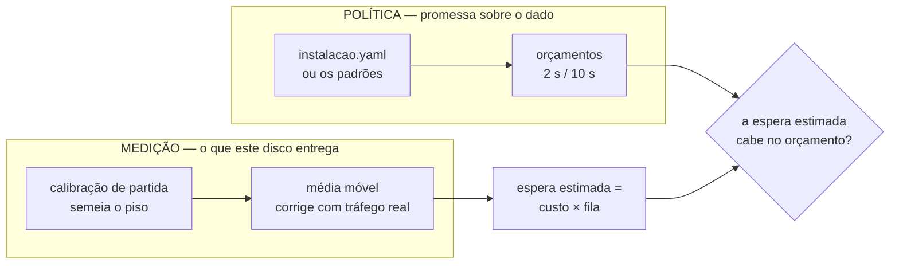

# SynkaCore V2.5 — O Orçamento é Promessa, o Disco é Medida

**Status:** Em desenvolvimento
**Data:** Agosto de 2026
**Depende de:** [V2.0](V2.0.md), [V2.1](V2.1.md), [V2.2](V2.2.md), [V2.3](V2.3.md), [V2.4](V2.4.md)

---

## A pergunta que a V2.4 deixou aberta

A V2.4 fez o gateway declarar saturação, com orçamentos de espera dimensionados pela
medição da V2.3 — feita num mini PC com NVMe. Duas coisas ficaram por resolver:

**A portaria nascia cega.** Sem nenhuma remessa concluída, ela não sabia quanto custa
gravar neste disco. A espera estimada era zero, cabia em qualquer orçamento, e todo
mundo entrava. A degradação era segura e valia exatamente no pior momento: logo após um
reinício do gateway, quando a frota inteira reconecta com o buffer cheio.

**Os orçamentos eram constantes no código.** Uma planta com outro perfil de operação
não tinha como declarar outro número sem recompilar.

---

## A separação que organiza a versão

Antes de resolver, foi preciso responder o que esses números **são**. A pendência da
V2.4 estava redigida assumindo uma resposta que não se sustentou.

> *"Numa planta com SSD SATA a gravação custa mais, a fila estoura o orçamento mais
> cedo, e a recusa começa antes do que deveria."*
> — `docs/V2.4.md`, redação original

O **"do que deveria"** presumia que o orçamento fosse um parâmetro de capacidade, a
ser compensado quando o hardware muda. Ele não é.

### O orçamento é uma promessa sobre o dado

"Uma amostra não espera mais que dois segundos na porta do gateway" é uma afirmação da
mesma espécie que `ClasseDeDado.LatenciaMaximaDeEntrega`, que desde a V2.0 diz há
quanto tempo uma amostra pode envelhecer no buffer da origem. É vocabulário de domínio,
e por isso mora na configuração da instalação — não em bandeira de linha de comando, e
muito menos derivado do disco.

Num disco mais lento, o gateway passa a recusar com a fila mais rasa. **Isso não é um
defeito a compensar.** A promessa continua sendo cumprida, e o que a planta descobre é
que aquele hardware não comporta aquela frota — informação verdadeira e acionável.

A alternativa recusada era derivar o orçamento do custo medido, para que a mesma frota
coubesse em qualquer máquina. Ela apaga a promessa: uma amostra passaria a esperar
trinta segundos num disco ruim sem que ninguém tivesse declarado isso, e o sistema se
acomodaria em silêncio ao pior hardware. **Um limite que se ajusta ao que o encosta
deixou de ser um limite.**

### O custo é medido, e entra pelo outro lado

O que o disco de fato determina — quanto custa confirmar uma transação — é medido, e
alimenta apenas a **estimativa de espera**, nunca a política.



Medição e política ficam separadas de propósito. Cruzá-las é o que produziria o
acomodamento silencioso.

---

## Verificado, não afirmado

Contra disco real (NVMe sobre btrfs), a partida mede e diz:

```
msg="disco do diario calibrado" custo_por_transacao=761.7µs
    espera_maxima_da_amostra=2s  remessas_na_fila_antes_de_recusar_amostra=2625
```

E o `/saude` já responde **antes da primeira remessa**, que é a lacuna que a V2.4
deixava aberta:

```json
{"ingestion":"accepting","ingestion_queue":0,"ingestion_cost_us":761, ...}
```

### A semente é um piso, e o tráfego a corrige

Sob carga de 400 origens, o custo observado no `/saude` ao longo da rodada:

| Momento | `ingestion_cost_us` |
|---|---|
| Partida, antes de qualquer remessa | **761** |
| Primeiros segundos de carga | 6.599 |
| Regime | **~4.000** |

A semente ficou **5,3× abaixo** do custo real de uma remessa, e isso é o
comportamento correto: ela mede uma transação de uma linha — o termo fixo, o `fsync` —
enquanto uma remessa real paga isso mais o trabalho por registro.

**Piso é a direção certa do erro.** Semear abaixo do real faz a portaria admitir um
pouco mais que o ideal nas primeiras remessas e jamais recusar alguém que caberia; a
média móvel corrige para cima em segundos. Errar para o lado de admitir é o erro
barato — recusar por engano custaria retransmissão de dado bom.

E ela é estritamente melhor que o zero da V2.4, que admitia **todo mundo**
indefinidamente até a primeira gravação concluir.

### A trava de partida

Um orçamento de evento menor que o de amostra inverteria a reserva — o gateway
passaria a recusar parada de máquina antes de recusar leitura de temperatura:

```
$ synkacore-gateway -instalacao invertida.yaml
synkacore-gateway: instalacao.NovaAdmissao: invalid_input: admissao:
  espera_maxima_do_evento (2s) e menor que espera_maxima_da_amostra (10s).
  Isso inverteria a reserva: o gateway recusaria evento discreto antes de
  recusar amostra, e a perda seria silenciosa
```

Código de saída 1. É erro de partida, e não aviso, porque **nada denunciaria depois**:
o gateway continuaria aceitando dado e respondendo saudável enquanto a contagem de
paradas ficasse permanentemente errada. É o buraco silencioso que a `ClasseDeDado`
existe para tornar impossível.

Orçamentos **iguais** são aceitos. Significam "sem reserva", que é uma configuração
pobre e ainda assim coerente — ninguém é recusado antes de quem tem menos a perder.
Recusá-la seria o gateway impor uma política que a instalação tem o direito de
escolher.

E um orçamento apertado é honrado de fato:

```
espera_maxima_da_amostra=400ms  remessas_na_fila_antes_de_recusar_amostra=552
```

Contra 2.625 com o padrão de 2 s, no mesmo disco.

---

## A calibração escreve numa tabela própria, e a razão não é limpeza

`calibracao_de_disco` é uma tabela separada no **mesmo arquivo** — mesmo WAL, mesmo
`fsync`. O que se mede ali é o que a ingestão vai pagar.

Gravar no próprio diário teria sido menos código e é inaceitável: **se o processo
morresse no meio da calibração, aquelas linhas ficariam lá e seriam projetadas para o
modelo de leitura** — dado fabricado, com aparência de medição, num sistema cuja
propriedade central é nunca mentir sobre o que observou. Nenhuma economia paga isso.

A limpeza roda em `defer`, com contexto próprio, inclusive no caminho de erro. Sem
isso, cada reinício deixaria linhas para trás e a partida seguinte mediria um arquivo
maior — a calibração piorando a si mesma a cada reinício, degradação que só apareceria
meses depois numa planta que ninguém visita.

**Mediana, e não média.** A calibração roda na partida, que é quando a máquina inteira
está subindo: um pico de I/O de outro serviço contaminaria uma amostra e arrastaria a
média para cima, fazendo o gateway nascer recusando. A mediana ignora o pico sem
precisar decidir o que é *outlier*.

**Falha aqui não derruba nada.** Mesma assimetria do servidor de tempo e do relatório
de comissionamento: o gateway sobe sem semente — o comportamento da V2.4 — e a média
móvel aprende com as primeiras remessas. Recusar-se a operar por causa de um
refinamento deixaria a planta sem aquisição.

---

## O `/saude` responde "o disco ou o orçamento?"

```json
{"ingestion":"shedding","ingestion_queue":316,"ingestion_wait_ms":2092,
 "ingestion_cost_us":6599,"ingestion_shed_samples":105,"ingestion_shed_events":0}
```

`ingestion_cost_us` é o campo novo, e ele existe para uma pergunta que os outros não
respondiam. Ao ver recusa alta, o operador precisa saber se **a mídia é lenta** ou se
**o orçamento é apertado** — as duas causas produzem exatamente o mesmo sintoma, fila
longa e amostras recusadas, e a ação certa é oposta em cada uma: trocar o disco, ou
revisar o que a instalação declarou.

O mesmo par aparece no log da partida, e é por isso que o custo medido e o orçamento
são registrados **juntos**. Separados, a pergunta não tem resposta.

---

## O que não é configurável, e por quê

| Não exposto | Motivo |
|---|---|
| **`VagasSimultaneas`** | Fica em um, sempre. O diário tem um escritor só — `SetMaxOpenConns(1)` —, e admitir mais não produziria paralelismo: produziria a mesma fila de volta dentro do `database/sql`, onde ninguém a mede. Expor este número ofereceria a quem opera uma alavanca que só pode piorar. |
| **Piso e teto do `Retry-After`** | O piso existe porque o cabeçalho tem resolução de segundos; o teto existe para que um gateway defeituoso não cale a frota. Nenhum dos dois diz respeito à planta. |

`fila_maxima` **é** exposto, e a razão de ele ser diferente vale registrar: ele não é
política, é **memória**. Cada remessa que espera segura o corpo vivo na mão, e é a
planta que sabe quantas origens existem e quanta RAM o equipamento tem.

---

## Um valor em dois lugares, e a trava que impede a divergência

`instalacao.AdmissaoPadrao` é a fonte autoritativa dos números, porque a política é uma
afirmação sobre o dado. `contrapressao.AjustesPadrao` existe para que aquele *package*
seja exercitável sozinho, sem importar domínio.

São o mesmo valor em dois lugares, por necessidade de camada. Dois conjuntos do mesmo
valor divergem, e o que ninguém lembra de atualizar é sempre o que está mais longe do
arquivo de configuração.

A garantia contra isso não é um comentário pedindo cuidado. É
`TestOsPadroesDosDoisLadosConcordam`, no adaptador que traduz um vocabulário no outro —
e ele reprova o build no dia em que alguém mudar um lado só.

---

## O que continua aberto

| Item | Situação |
|---|---|
| **A semente subestima por ~5×** | Ela mede uma transação de uma linha; uma remessa de 100 envelopes custa mais. Medir com um lote representativo daria uma semente melhor, mas exigiria o gateway adivinhar o tamanho de lote da frota antes de a frota falar. Fica como está: piso conhecido é melhor que previsão errada. |
| **Calibração não é reexecutada** | Ela roda uma vez, na partida. Um disco que degrada ao longo de meses só aparece na média móvel — o que é suficiente para a admissão, mas o `/saude` não distingue "sempre foi assim" de "piorou". Sem série histórica, ninguém vê a curva. |
| **Recusa continua sem série histórica** | Herdado da V2.4 e não fechado: os contadores vivem em memória e zeram no reinício. Existe o instantâneo, não a história. |
| **Separar a conexão de leitura** | Herdado da V2.3. `SetMaxOpenConns(1)` continua fixando o teto em ~20.000 env/s, e a V2.4 tornou a fila visível sem encurtá-la. |
| **A projeção não passa pela portaria** | Herdado da V2.4. As leituras da projeção disputam a mesma conexão única e não aparecem na fila medida — entram como ruído no custo médio em vez de serem contadas. |
| **Medido numa mídia só** | A calibração agora mede o disco de cada instalação, o que era o ponto. Mas o comportamento do sistema INTEIRO sob SSD SATA ou cartão SD continua não observado — só o custo por transação passou a ser conhecido. |
| **Revogação de credencial** | Herdado da V2.1, decidido não fazer agora. Um dispositivo comprometido segue aceito até o certificado vencer. |
