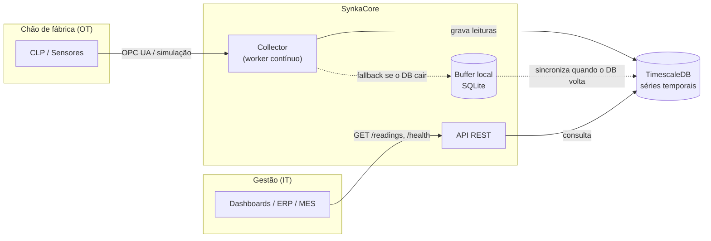
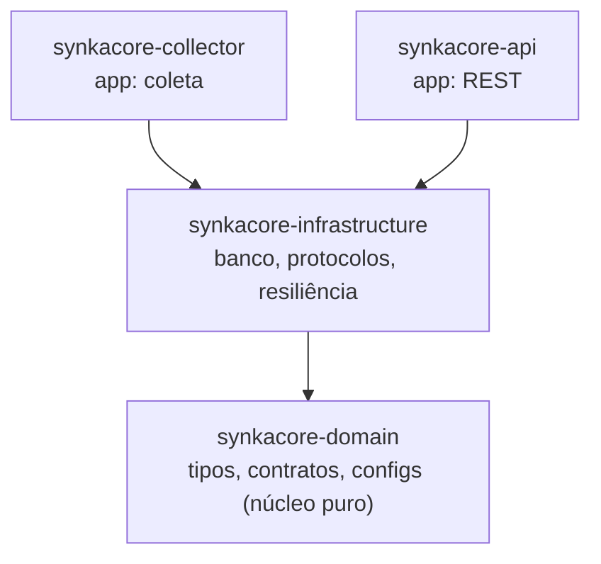
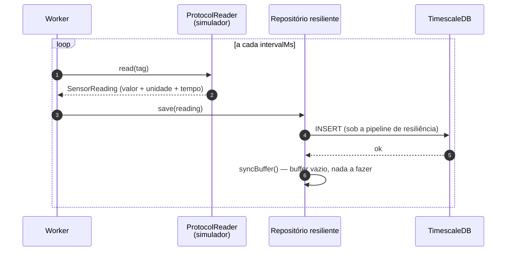
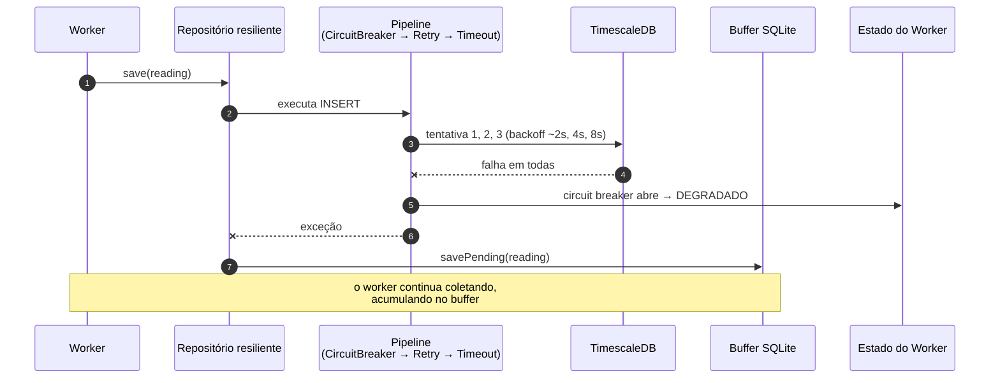
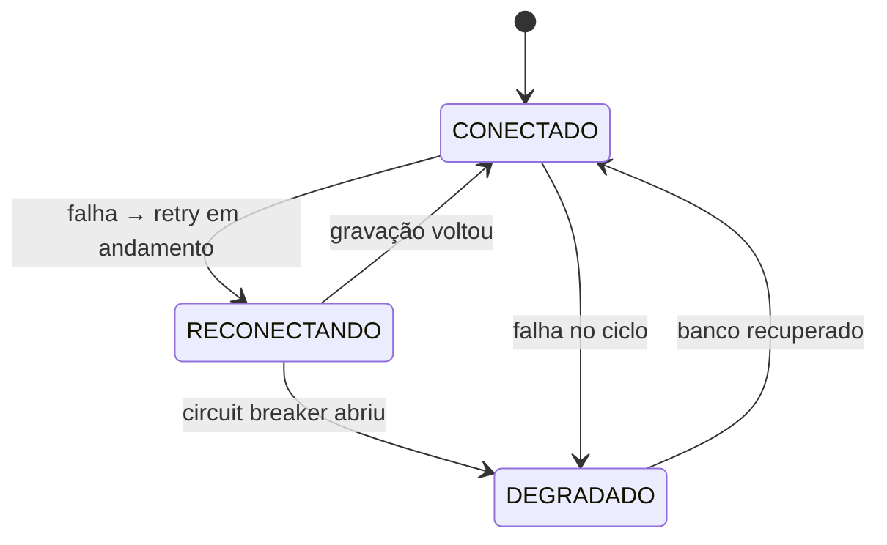

# SynkaCore — Visão Geral Visual

Um mapa intuitivo do projeto: o que ele faz, como as peças se conectam e o que acontece em cada
cenário. Para o mergulho profundo no código, veja o guia de estudo do time.

---

## O que é, em uma imagem

O SynkaCore é a ponte confiável entre o **chão de fábrica (OT)** e os **sistemas de gestão (IT)**.
Ele coleta, normaliza, guarda e expõe os dados — e **não perde nada** se o banco cair.



---

## As quatro peças (módulos)

O projeto é um Maven multi-módulo em **Clean Architecture**: a dependência sempre aponta para
dentro, em direção ao núcleo puro.



| Módulo | Papel | Exemplos |
|---|---|---|
| **domain** | Núcleo puro: o *quê* | `SensorReading`, `ProtocolReader`, `ReadingRepository` |
| **infrastructure** | Tecnologia: o *como* | TimescaleDB, SQLite, Resilience4j, Eclipse Milo, simulador |
| **collector** | App que coleta | `SensorCollectorWorker` + wiring |
| **api** | App que expõe | `GET /readings`, `GET /health` |

A vantagem: trocar a **fonte de dados** (simulador → OPC UA real) é mudar **um bean**, sem tocar no
worker.

---

## Fluxo normal de coleta

A cada intervalo configurado, o worker lê uma medição e a grava. Em operação saudável, o buffer fica
vazio.



---

## O que acontece quando o banco cai

Aqui está o diferencial. A gravação tenta de novo, o disjuntor protege o banco, e a leitura é desviada
para o buffer local — **sem perder dado** e **sem matar o worker**.



E quando o banco volta, o buffer é drenado em ordem cronológica:

```mermaid
sequenceDiagram
    autonumber
    participant R as Repositório resiliente
    participant DB as TimescaleDB
    participant BUF as Buffer SQLite
    participant ST as Estado do Worker

    Note over DB: banco volta; circuit breaker fecha
    R->>DB: próxima gravação normal
    DB-->>R: ok
    ST->>ST: CONECTADO
    R->>BUF: getPending(lote)
    loop cada pendência, em ordem
        R->>DB: INSERT
        DB-->>R: ok
        R->>BUF: markAsSynced(id)
    end
    Note over R,BUF: repete a cada gravação até o buffer esvaziar
```

---

## Os três estados do Worker

O worker sempre sabe em que situação está, e isso aparece nos logs e (futuramente) em métricas.



---

## Stack tecnológica

| Camada | Tecnologia |
|---|---|
| Linguagem / framework | Java 25 + Spring Boot 3.5 |
| Build | Maven (multi-módulo) |
| Banco de séries temporais | PostgreSQL + TimescaleDB |
| Acesso a dados | Spring `JdbcClient` |
| Buffer local | SQLite |
| Resiliência | Resilience4j (circuit breaker, retry, timeout) |
| Protocolo industrial | OPC UA (Eclipse Milo) |
| Logging | SLF4J + Logback |
| Testes | JUnit 5, Mockito, Testcontainers |

---

## Como rodar (resumo)

```bash
# 1) Banco (TimescaleDB) — SQL de criação da tabela em docs/V1.0.md
docker run -d --name synkacore-timescaledb \
  -e POSTGRES_PASSWORD=synkacore -e POSTGRES_DB=synkacore -p 5432:5432 \
  timescale/timescaledb:latest-pg17

# 2) Build + testes
mvn clean verify

# 3) Rodar (terminais separados)
mvn -pl synkacore-collector spring-boot:run
mvn -pl synkacore-api spring-boot:run

# 4) Consultar
curl http://localhost:8080/readings
curl http://localhost:8080/health
```

---

## Estrutura de pastas

```
SynkaCore/
├── synkacore-domain/          # tipos, contratos, configs, exceções (núcleo puro)
├── synkacore-infrastructure/  # persistência, protocolos, resiliência, simulação
├── synkacore-collector/       # app: worker de coleta contínua
├── synkacore-api/             # app: REST de consulta + health
├── config/                    # configs de qualidade (spotbugs, pmd, checkstyle)
└── docs/                      # documentação (esta visão geral, versões, trade-offs, qualidade)
```

---

## Para se aprofundar

- **Versões e o que cada uma entregou**: `docs/V1.0.md`, `V1.1.md`, `V1.2.md`.
- **Decisões e seus custos**: `docs/TRADE-OFFS.md`.
- **Garantias de qualidade do build**: `docs/QUALIDADE.md`.
