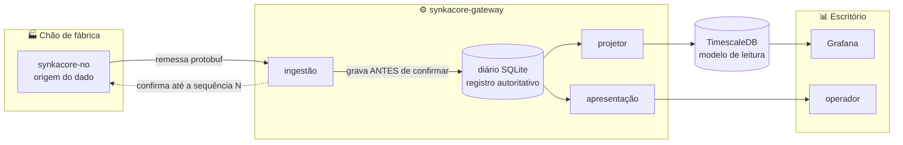
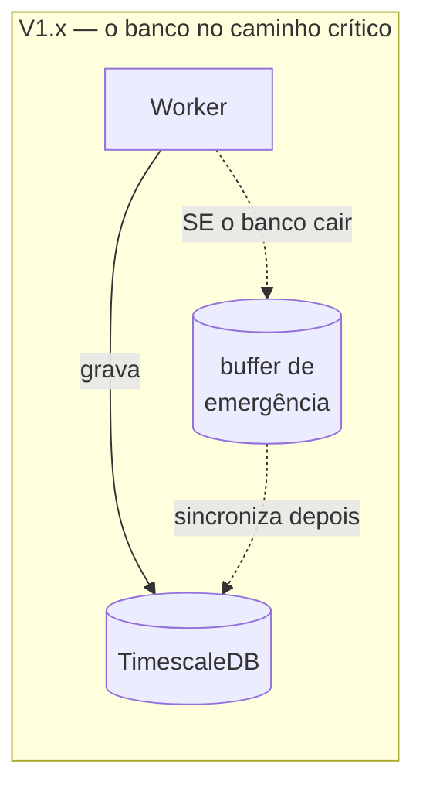
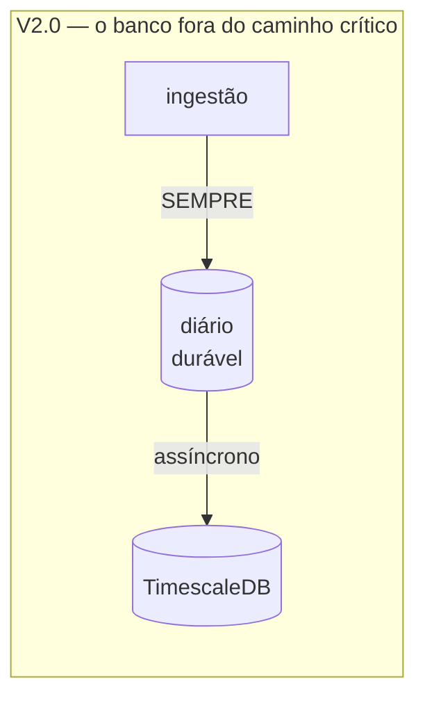
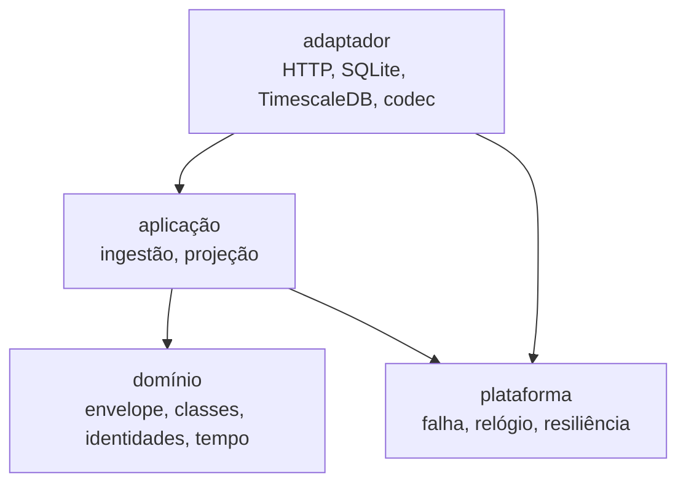
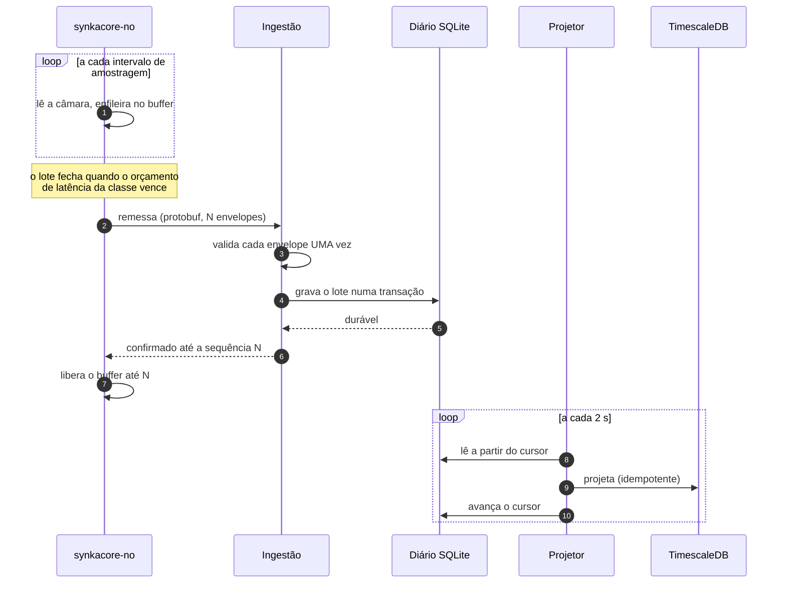
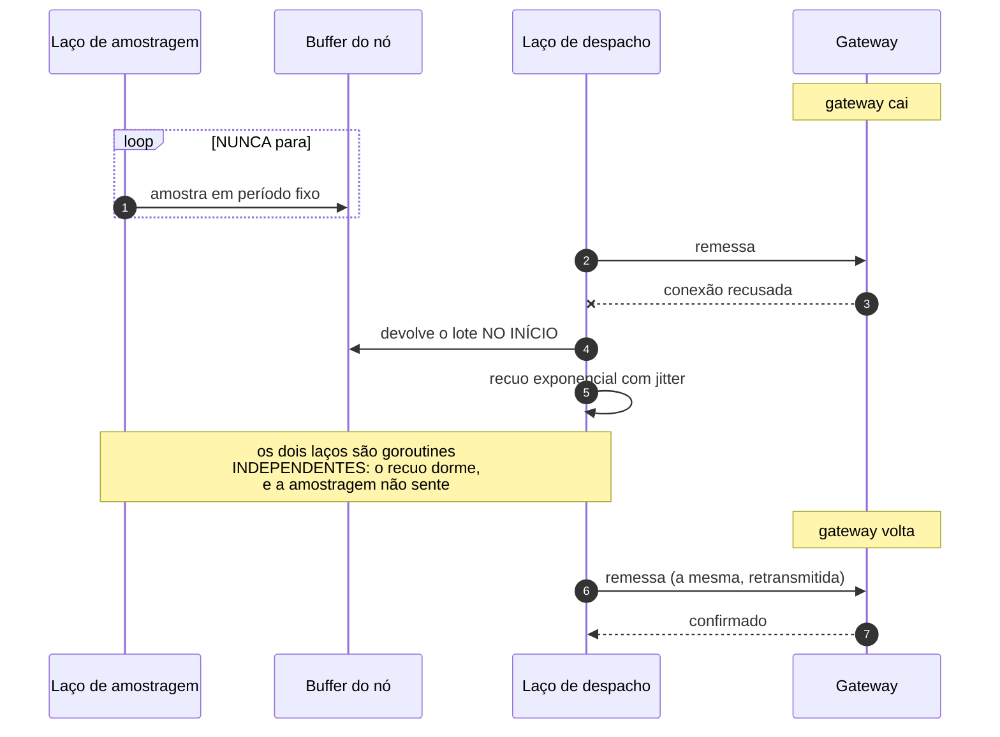
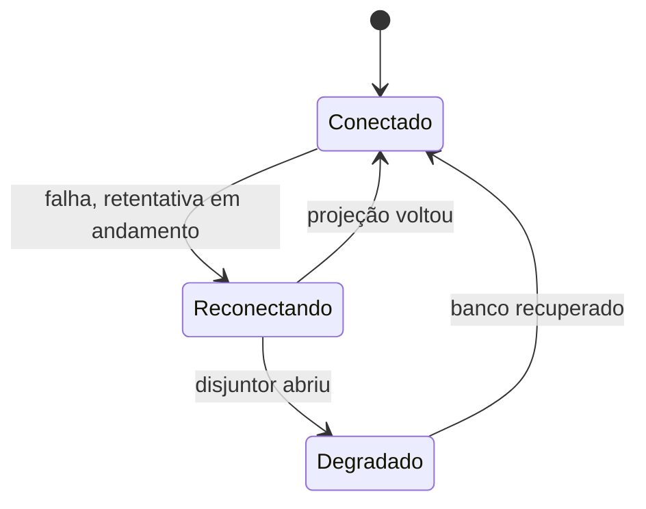
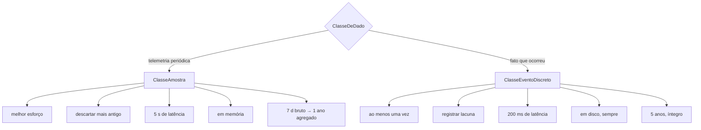
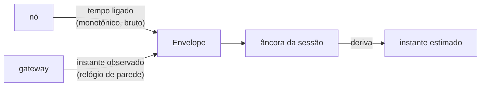

# SynkaCore — Visão Geral Visual

Um mapa intuitivo do projeto: o que ele faz, como as peças se conectam e o que acontece em
cada cenário.

---

## O que é, em uma imagem

O SynkaCore é a ponte confiável entre o **chão de fábrica (OT)** e os **sistemas de gestão
(IT)**. Ele coleta, valida, torna durável e expõe os dados — e **não perde nada**.



---

## A mudança que reorganizou tudo

Vale ver as duas versões lado a lado, porque a diferença explica quase todo o resto.





Na V1.x, "zero perda" dependia de o caminho pontilhado funcionar no pior momento possível —
e a auditoria da V1.2 encontrou esse caminho **desligado por um erro de tipo**: o buffer
estava registrado e nunca era usado.

Na V2.0 não há caminho pontilhado. Se o diário falha, a remessa **não é confirmada** e o nó
retransmite. Zero perda deixou de ser promessa e virou consequência de só existir um caminho.

---

## As peças



| Camada | Papel | Exemplos |
|---|---|---|
| **domínio** | Regras. Sem I/O, sem framework, sem relógio. | `Envelope`, `ClasseDeDado`, `AncoraDeSessaoDeBoot`, `IDDoPontoDeMedicao` |
| **aplicação** | Casos de uso | `ingestao.Servico`, `projecao.Servico` |
| **adaptador** | Entrada e saída | `ingressohttp`, `diariosqlite`, `projetortimescale`, `codecdefio` |
| **plataforma** | Transversal, não depende de ninguém | `falha`, `relogio`, `resiliencia` |

---

## Fluxo normal



Repare na **ordem**: a confirmação só sai depois de o diário confirmar a transação. E o
cursor da projeção só avança depois de a gravação estar no TimescaleDB.

Nos dois casos a ordem inversa pareceria equivalente e não é. Confirmar antes de gravar faria
o nó liberar o buffer de dado que não existe. Avançar o cursor antes de projetar perderia o
intervalo para sempre. Nesta ordem, uma queda apenas **refaz trabalho** — e refazer é
inofensivo, porque as duas gravações são idempotentes.

---

## O que acontece quando o gateway cai



Os dois laços serem independentes não é detalhe. Numa versão anterior eles dividiam um
`select`, e o recuo do despacho — que **dorme** — bloqueava o temporizador de amostragem: uma
queda de 12 segundos produziu 15 segundos **sem nenhuma medição**.

A distinção que isso revela:

- O buffer protege contra perder dado **no caminho**. Para isso, funcionava.
- Dado que **nunca foi medido** não está em buffer nenhum. Nenhuma retransmissão o traz de
  volta.

---

## O que acontece quando o TimescaleDB cai



E o que **não** acontece: nada com a aquisição. O nó continua entregando, o gateway continua
confirmando, o diário continua crescendo. O que para é o espelhamento para o banco de
consulta.

Por isso o `/saude` reporta os dois estágios separados:

```json
{"journal":"available","projection":"degraded", ...}
```

| Linha | Se falhar significa | Acorda alguém? |
|---|---|---|
| `journal` | O sistema está perdendo a capacidade de **aceitar** dado | Sim |
| `projection` | O dado está salvo; os dashboards estão atrasados | Não |

Juntar as duas num único `healthy` faria o operador tratar uma queda do TimescaleDB como
emergência de aquisição.

---

## As duas classes de dado

Toda a política do sistema sai daqui. O dado é classificado pela **garantia que exige**, não
pelo assunto.



Uma amostra de temperatura e uma parada de máquina têm requisitos **opostos**: a primeira
tolera perda porque a próxima repõe quase a mesma informação; a segunda não tem vizinha que
a substitua, e a contagem fica permanentemente errada sem ninguém perceber.

É por isso que, quando o buffer do nó satura, ele sacrifica a **amostra mais antiga** antes
de qualquer evento — e se só restarem eventos, o descarte vira um **marcador de lacuna
visível no dado**, com intervalo e contagem.

> A diferença prática entre um sistema que mente e um que admite o que não sabe.

---

## Os três tempos, separados



O nó **nunca afirma saber a hora** — sem relógio de tempo real com bateria, ao ligar ele
começa em 1970. Ele reporta apenas tempo monotônico desde o boot.

O gateway carimba a recepção e ancora a sessão. Os três valores ficam separados e auditáveis,
e **o derivado jamais sobrescreve o bruto**: se a estimativa estiver errada, o original ainda
permite recomputar.

E o relógio do próprio gateway é vigiado: a âncora guarda a leitura de **parede** e a
**monotônica** juntas. Um acerto de hora move só a parede, então a divergência vira
mensurável e a série daquela sessão é marcada como temporalmente suspeita — em vez de ficar
silenciosamente deslocada.

---

## Como rodar (resumo)

```bash
# Sem infraestrutura nenhuma — a aquisição funciona completa
make compilar
./bin/synkacore-gateway     # terminal 1
./bin/synkacore-no          # terminal 2

curl http://127.0.0.1:8080/saude
curl 'http://127.0.0.1:8080/leituras?limite=10'

# Com o modelo de leitura e os dashboards
make infra
make gateway-completo
make no
```

---

## Para se aprofundar

- **[V2.0](V2.0.md)** — a reescrita: por que foi antecipada e o que foi encontrado no caminho.
- **[Trade-offs](TRADE-OFFS.md)** — decisões e seus custos.
- **[Qualidade](QUALIDADE.md)** — os portões do build.
- **Histórico V1.x** — [V1.0](V1.0.md) · [V1.1](V1.1.md) · [V1.2](V1.2.md).
